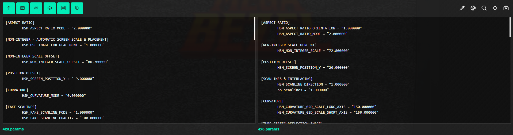

# Bezel Preset Editor


[](https://hgoda90.github.io/bezel-preset-editor/)

An advanced editor for **Mega Bezel**, **Koko-AIO**, and **UBorder** presets.  
Supports live previews, incremental rendering, color adjustments, and interactive workflow tools.

---

## Table of Contents

- [Features](#features)
  - [Settings Controls](#settings-controls)
  - [Reference Lines](#reference-lines)
  - [Toolbar Buttons](#toolbar-buttons)
  - [MiniPlayer Controls](#miniplayer-controls)
  - [Workflow Summary](#workflow-summary)
- [Installation](#installation)
- [Screenshots](#screenshots)
- [License](#license)

---

## Features

### Settings Controls
- **Setting Checkbox**: Toggles whether a setting is active; unchecked items are ignored in the output.
- **Reset Button**: Resets individual parameters to default values without affecting others.
- **Value Input**: Numeric input controlling a parameter, with real-time validation and min/max/step limits.

### Reference Lines
- **Add / Remove Reference Lines**: Insert reference lines to slangp files.
- **Collapse / Expand**: Reduce visual clutter by collapsing sections.

### Toolbar Buttons
- **Scroll to Top**: Jump to the top of the settings list.  
- **Settings → Text**: Populate text area with current settings.  
- **Load / Merge File**: Load or merge preset files (`.slangp, .pre, .params`).  
- **Save File**: Export current preset.  
- **Add Section Labels**: Organize settings visually.  
- **Color Vision & Color Thief**: Preview or sample colors.  
- **Quick Navigation**: Jump to specific settings.  
- **Clear All Settings**: Reset all settings.  
- **Entertainment Loader**: Open MiniPlayer for YouTube, Twitch, or local videos.

### MiniPlayer Controls
- **Drag**: Move MiniPlayer; double-click resets position.  
- **Zoom**: Cycle through preset sizes (276p, 360p, 480p, 720p, 1080p).  
- **Close**: Stops video and closes MiniPlayer.  
- **Add / Load**: Load content from YouTube, Twitch, or local files.

### Workflow Summary
- Load a preset to begin editing.  
- Edit settings with checkboxes, numeric inputs, and reference lines.  
- View or edit raw config with **Settings → Text**.  
- Save or merge presets.  
- Collapse sections and navigate quickly in large files.

---

## Installation

```git clone https://github.com/hgoda90/bezel-preset-editor.git```  

Open `index.html` in a modern browser. Fully client-side; no additional dependencies required.

---

## Screenshots

<!-- Replace with actual images or GIFs -->

  


---

## License

MIT © hgoda90